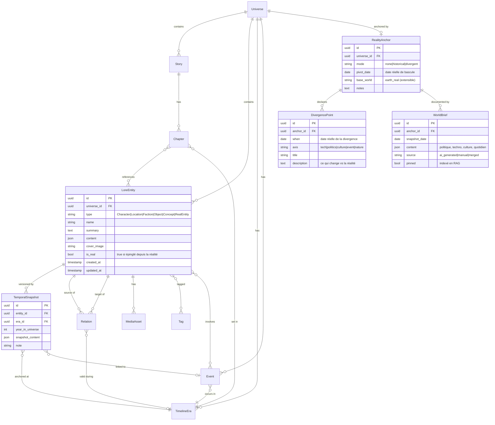

# Romanesk — Product Requirements Document (v0.3.1)

> Statut : **Approuvé pour Phase 0** — conception lancée.
> Auteur : Hugo Morales · Date : 2026-05-02 · Cible : usage personnel d'abord, **distribution propriétaire source-available, free-use** prévue.

> **Changelog v0.3.1 (2026-05-02)** : pivot du modèle de distribution → **Elastic License 2.0** (propriétaire source-available, free-use total) à la place de l'open-source AGPL. Section 15 réécrite ; OQ8b clôturée ; NG6 reformulée.
>
> **Changelog v0.3** : positionnement de distribution (section 15), assouplissement NG6, OQ8 enrichie sur la licence, retrait du « cible : single-user » exclusif (l'outil reste personnel mais ouvert à un public plus large).
>
> **Changelog v0.2** : ajout du concept `RealityAnchor` (modes `none` / `historical` / `divergent`), entités `DivergencePoint` et `WorldBrief`, Module 6 dédié, requirements R-P0-11/12/13 et R-P1-10/11/12, sous-section *Injection du World Context* dans la stratégie IA, OQ9-OQ12, intégration au phasing Phase 3 & 5.

---

## 1. Executive summary

Romanesk est un **environnement d'écriture local-first** dédié à la création d'univers fictionnels et de leurs récits. L'outil traite l'univers (le *lore*) comme un objet de premier rang — pas comme une annexe au manuscrit — et garantit sa cohérence à travers toutes les œuvres qui s'y déroulent, grâce à un graphe d'entités (personnages, lieux, factions, événements) versionné dans le temps narratif.

Romanesk gère également des **univers ancrés dans la réalité** : un récit peut se baser sur la connaissance historique d'une date pivot (un personnage de 2003 sait ce qu'on savait en 2003) ou diverger de la réalité à partir d'un point de bascule, façon uchronie (le Fallout-verse, les Mondes parallèles, les post-apo datés). Cet ancrage est une couche de contexte que l'IA respecte sans avoir besoin que l'auteur réécrive l'histoire du monde.

Une couche IA pluggable (Claude, GPT, Gemini, Mistral en cloud ; Gemma 4, Llama, Mistral en local via Ollama) assiste l'auteur sur sept usages : continuation, cohérence, Q&A sur le lore (RAG), génération de fiches, réécriture stylistique, brainstorm, synthèses. Un module dédié — *Atelier de description* — produit des descriptions littéraires à partir d'un brief texte ou d'une image fournie par l'auteur.

L'outil est conçu en partant du **lore** (worldbuilding-first), puis se déploie vers la fiction. Données 100 % sur la machine, sync optionnelle vers un backend privé.

---

## 2. Problem statement

L'écriture d'un univers fictionnel ambitieux — *a fortiori* multi-récits, multi-époques, multi-personnages — confronte l'auteur à un problème de **mémoire et de cohérence** que les outils actuels résolvent mal :

- **Word / Pages / Google Docs** : aucune notion de structure narrative. Tout est texte plat.
- **Scrivener** : excellent pour structurer un manuscrit, faible pour le worldbuilding partagé entre œuvres.
- **Notion / Obsidian** : flexibles mais sans modèle narratif natif. L'auteur réinvente la roue à chaque univers, et la cohérence reste manuelle.
- **World Anvil / Campfire** : worldbuilding solide mais éditeurs de texte faibles, dépendance cloud, prix d'abonnement.
- **Sudowrite / NovelCrafter** : IA d'écriture puissante, mais lore traité de façon plate, enfermé dans des silos cloud sans export possible.

**Aucun outil ne combine** : (1) un graphe de lore versionné dans le temps narratif, (2) un éditeur de manuscrit professionnel, (3) une IA pluggable cloud/local, (4) une garantie local-first/privée. C'est cette combinaison que Romanesk vise.

---

## 3. Vision produit

> **Une cathédrale narrative que l'auteur construit pierre par pierre, avec un IA-copiste qui connaît chaque pierre déjà posée.**

Romanesk se distingue par trois partis pris :

1. **Lore-first**. Le worldbuilding est l'objet central, pas un onglet secondaire. L'utilisateur peut produire 200 fiches d'univers avant d'écrire la première ligne d'un chapitre — et l'outil reste utile.
2. **Cohérence temporelle native**. Une entité (personnage, lieu, faction) n'a pas un seul état : elle a une **histoire de versions** liées aux époques de l'univers. L'outil sait répondre à « à quoi ressemblait Aldric en 1200 vs en 1850 » sans hallucination.
3. **IA assistante, pas IA générative seule**. L'IA ne remplace pas l'auteur : elle navigue le lore, signale les incohérences, propose des descriptions, brainstorme. L'auteur garde la main sur chaque mot publié.
4. **Ancrage réel comme socle optionnel**. Un univers Romanesk peut être pur fictif (ex. high fantasy), pur historique (les faits réels font autorité), ou divergent (la réalité jusqu'à un point pivot, fiction ensuite). L'IA reçoit en contexte un *World Brief* qui décrit la réalité au moment T + les divergences déclarées, garantissant qu'un personnage de 2003 ne mentionne pas l'iPhone et qu'un univers façon Fallout reste cohérent avec sa propre uchronie.

---

## 4. Goals

| # | Goal | Mesure |
|---|------|--------|
| G1 | Permettre à l'auteur de modéliser un univers complet (entités, relations, timeline) sans configuration préalable | Création d'une 1ʳᵉ fiche complète en < 3 min |
| G2 | Garantir la cohérence du lore via le moteur IA (détection d'incohérences sur 90 % des contradictions factuelles introduites) | Eval interne sur jeu de tests |
| G3 | Offrir un éditeur de manuscrit professionnel (chapitrage, statistiques, focus mode) à parité avec Scrivener pour le single-novel | Test utilisateur (auto-évaluation) |
| G4 | Permettre à l'auteur de switcher de provider IA (Claude / GPT / Gemma 4 local) sans changer son workflow | < 30 s pour basculer un projet vers un autre provider |
| G5 | Garantir que l'outil fonctionne 100 % offline avec Gemma 4 en local | Build offline-only validé en CI |

## Non-goals

| # | Non-goal | Pourquoi |
|---|----------|----------|
| NG1 | Collaboration multi-utilisateurs en temps réel | Outil personnel, hors scope. Pourra être ré-évalué si évolution SaaS. |
| NG2 | Auto-publication sur Wattpad / Amazon KDP / autre plateforme | Hors périmètre rédaction-cohérence. Export propre suffit. |
| NG3 | Génération automatique d'un roman complet sur prompt | Romanesk est une *aide* à la rédaction, pas un automate. Pas de bouton « écris-moi un roman ». |
| NG4 | Mobile natif (iOS/Android) | Stack desktop d'abord. Une *companion app* en lecture-seule pourra venir en v2. |
| NG5 | Monétisation, billing, multi-tenant | Outil perso, on coupe toute la complexité SaaS. |
| NG6 | Marketplace officielle de templates ou de lore tiers | Hors scope v1. Pourra émerger informellement (échanges de fichiers `.romanesk` entre auteurs). |

---

## 5. Persona unique

**Hugo l'architecte de mondes.** Auteur passionné, perfectionniste sur la cohérence, écrit dans plusieurs genres, alterne sessions de worldbuilding pur et sessions d'écriture. Veut garder le contrôle de ses données (pas de cloud), maîtrise la technique (peut faire tourner Ollama localement), valorise la qualité éditoriale plus que la productivité brute.

**Frustrations actuelles :** outils éclatés (Notion + Word + bouts de papier), pertes de cohérence d'un projet à l'autre, impossibilité d'interroger son propre lore en langage naturel, IA cloud qui voient tout son travail.

---

## 6. Modules & user stories

L'application s'organise en **7 modules**. User stories groupées par module, ordonnées par priorité.

### Module 1 — Univers & Bibliothèque

- En tant qu'auteur, je veux **créer un univers nommé** avec une description et des paramètres (genre dominant, langue, époque pivot) afin de poser le cadre de mes histoires.
- En tant qu'auteur, je veux **lister tous mes univers** dans une bibliothèque, y compris des univers indépendants entre eux.
- En tant qu'auteur, je veux **archiver / dupliquer** un univers pour expérimenter une variante sans risque.

### Module 2 — Entités du lore (Personnages, Lieux, Factions, Objets, Concepts)

- En tant qu'auteur, je veux **créer une fiche personnage** avec nom, alias, archétype, traits de caractère, apparence, capacités, voix, biographie, relations.
- En tant qu'auteur, je veux **créer une fiche lieu** avec géographie, atmosphère, climat, culture, faction dominante, points d'intérêt, galerie d'images. *(symétrique à Personnage)*
- En tant qu'auteur, je veux **créer des fiches Faction, Objet, Concept** avec un socle commun (nom, résumé, description riche, tags, images) plus des champs spécifiques au type.
- En tant qu'auteur, je veux **lier deux entités par une relation typée** (allié, ennemi, mentor de, contrôle, situé dans, descendant de…) afin de bâtir le graphe.
- En tant qu'auteur, je veux **filtrer et rechercher** les entités par type, tags, faction, lieu, époque.
- En tant qu'auteur, je veux **attacher des images** (carte d'un lieu, portrait d'un personnage) qui servent de référence visuelle et de contexte multimodal pour l'IA.

### Module 3 — Timeline & fiches temporelles

- En tant qu'auteur, je veux **définir des époques** dans mon univers (ex. *Premier Âge*, *Ère des Cendres*, *Renouveau*) avec dates/bornes.
- En tant qu'auteur, je veux **ajouter à une entité un *snapshot temporel*** — une version de cette entité à une époque donnée — afin de modéliser son évolution. *(Exemple : Aldric en 1200 = jeune capitaine ; Aldric en 1850 = revenant immortel.)*
- En tant qu'auteur, je veux **placer des événements** sur la timeline et y rattacher des entités (qui était là, où, dans quel état).
- En tant qu'auteur, je veux que **les relations entre entités soient elles-mêmes datables** (Aldric et Liane sont alliés *de 1200 à 1230*, ennemis *à partir de 1245*).
- En tant qu'auteur, je veux **visualiser la timeline** en frise horizontale avec couches par entité.

### Module 4 — Histoires & chapitrage

- En tant qu'auteur, je veux **créer une histoire** rattachée à un univers (ou indépendante) avec type (roman, nouvelle, série) et synopsis.
- En tant qu'auteur, je veux **chapitrer** mon histoire (titre, ordre, statut : brouillon / révisé / final) et écrire dans un éditeur riche.
- En tant qu'auteur, je veux **déclarer quelles entités du lore apparaissent** dans un chapitre, et à quelle époque ce chapitre se déroule, afin que l'IA contextualise correctement.
- En tant qu'auteur, je veux des **statistiques d'écriture** (mots, sessions, vélocité) sans qu'elles soient mises en avant.

### Module 5 — Couche IA

- En tant qu'auteur, je veux **configurer un ou plusieurs providers IA** (Anthropic, OpenAI, Google, Mistral, Ollama local) avec mes clés, et désigner un *default* + un *fallback*.
- En tant qu'auteur, je veux **interroger mon lore en langage naturel** (« Quels personnages connaissaient Aldric avant 1200 ? ») et recevoir une réponse sourcée sur les fiches.
- En tant qu'auteur, je veux que **l'IA détecte les incohérences** quand je modifie un chapitre ou une fiche (« Aldric ne peut pas être à Veliane en 1245, il est mort en 1240 »).
- En tant qu'auteur, je veux **générer une fiche de personnage / lieu / faction** à partir d'un brief court, avec génération conforme au style et au lore existant.
- En tant qu'auteur, je veux **continuer un paragraphe** dans le ton du chapitre, en faisant référence au lore quand pertinent.
- En tant qu'auteur, je veux **réécrire** un passage sélectionné selon une consigne (alléger, varier le vocabulaire, plus visuel, plus tendu).
- En tant qu'auteur, je veux **brainstormer** dans un panneau latéral (chat) qui a accès au lore comme contexte.
- En tant qu'auteur, je veux **résumer** un chapitre, un arc, ou la trajectoire d'un personnage en un clic.

### Module 6 — Ancrage réel & univers divergents

- En tant qu'auteur, je veux **ancrer mon univers à la réalité** en choisissant un mode : *aucun* (pure fiction), *historique* (réalité fait autorité), *divergent* (réalité jusqu'à un point pivot, puis bifurcation).
- En tant qu'auteur, je veux **définir une date pivot** dans le calendrier réel (ex. 21 décembre 2003) à partir de laquelle mon univers prend ses libertés.
- En tant qu'auteur, je veux que **l'IA charge automatiquement un *World Brief* de la réalité à cette date** (politique, technologie, culture, vie quotidienne) et l'utilise comme contexte pour ses générations.
- En tant qu'auteur, je veux **déclarer des points de divergence** : événements, technologies, ou faits qui *n'existent pas* dans mon univers (« le transistor n'a jamais été inventé », « les Beatles ne se sont jamais formés », « un super-tsunami a frappé en décembre 2003 »).
- En tant qu'auteur, je veux que **l'IA respecte mes divergences** : si j'écris « 2077, USA » dans un univers façon Fallout, l'IA ne propose pas de smartphones ni d'IA modernes, mais des terminaux à cathodiques et de la robotique atomique.
- En tant qu'auteur, je veux **éditer le World Brief manuellement** : si l'IA résume mal 2003 ou si je veux insister sur un détail (« Internet était encore majoritairement en bas débit »), je peux ajouter / corriger.
- En tant qu'auteur, je veux **épingler des entités réelles** comme entités du lore (un président, un lieu réel, une institution) pour pouvoir les référencer dans des relations sans avoir à tout réécrire.
- En tant qu'auteur, je veux que **la détection de cohérence inclue les anachronismes** : si j'écris « il dégaina son iPhone » dans un chapitre daté de 1995, l'IA me signale le conflit.

### Module 7 — Atelier de description IA

- En tant qu'auteur, je veux **dicter ou écrire un brief** (ex. « ville portuaire baroque, brouillard permanent, marchands d'épices, faction du Crépuscule au pouvoir ») et recevoir une **description littéraire complète** dans le ton du projet.
- En tant qu'auteur, je veux **uploader une image / photo** et recevoir une description littéraire utilisable telle quelle ou comme base de travail.
- En tant qu'auteur, je veux que la description générée **utilise mon lore existant comme contexte** (faction citée → l'IA connaît la faction, ne réinvente pas).
- En tant qu'auteur, je veux **insérer la description** directement dans une fiche Lieu ou un chapitre, en ayant la possibilité de l'éditer avant.

---

## 7. Modèle de données

### 7.1 Vue conceptuelle



### 7.2 Entités principales

| Entité | Rôle | Champs clés |
|--------|------|-------------|
| `Universe` | Conteneur racine | name, description, settings (langue, genre dominant, calendrier), created_at |
| `Story` | Œuvre rattachée à un univers (ou orpheline) | title, type (roman / nouvelle / série), synopsis, status, target_word_count, era_id (époque pivot) |
| `Chapter` | Unité d'écriture | story_id, order, title, body (rich text/Markdown), word_count, status, era_id, referenced_entities[] |
| `LoreEntity` | **Entité polymorphe** : Personnage, Lieu, Faction, Objet, Concept | type, name, summary, content (champs spécifiques au type sérialisés en JSON), tags[] |
| `TemporalSnapshot` | Version d'une entité à une époque | entity_id, era_id, year_in_universe, snapshot_content (description, traits, statut, apparence, allégeance, localisation à cette époque) |
| `TimelineEra` | Époque de l'univers | name, start_year, end_year, description, color |
| `Event` | Événement situé dans le temps | name, year, era_id, description, participants[entity_ids], locations[entity_ids] |
| `Relation` | Arête typée du graphe | source_id, target_id, type (ally_of, mentor_of, ruled_over, located_in, descendant_of…), era_id (optionnel : relation valide à cette époque) |
| `Tag` | Étiquette transversale | name, color |
| `MediaAsset` | Image / fichier attaché | entity_id, path, kind, alt_text |
| `Embedding` | Chunk vectorisé pour RAG | source_type, source_id, content, vector, model |
| `AISession` | Trace des interactions IA | timestamp, provider, model, prompt, response, context_used, cost_estimate |
| `Note` | Note libre rattachée à une entité | entity_id, body, created_at |
| `RealityAnchor` | Configuration d'ancrage à la réalité | mode (`none` / `historical` / `divergent`), pivot_date, base_world, notes |
| `DivergencePoint` | Point de bascule par rapport à la réalité | when, axis (tech / politics / culture / event / nature), title, description |
| `WorldBrief` | Synthèse de la réalité à une date donnée | snapshot_date, content (politique, techno, culture, quotidien), source, pinned |

### 7.3 Pourquoi cette modélisation des fiches temporelles

Plutôt que dupliquer une fiche complète par époque (lourd, source d'incohérences), on stocke **une entité canonique** + **N snapshots** qui contiennent uniquement *ce qui change à cette époque*. Le rendu d'une fiche à l'époque T est calculé : `entity.base + snapshot[T].overrides`. Bénéfices :

- Cohérence garantie par construction (un seul nom canonique)
- Diff entre époques trivial à afficher (« qu'est-ce qui change pour Aldric entre 1200 et 1850 »)
- Le RAG indexe la version pertinente selon l'époque du chapitre courant

### 7.4 Ancrage réel : trois modes unifiés

Le `RealityAnchor` est **une seule mécanique** qui couvre trois usages :

| Mode | Usage | Comportement |
|------|-------|--------------|
| `none` | Pure fiction (high fantasy, SF lointaine) | Aucun World Brief, aucune référence à la réalité ; l'IA reste dans le lore déclaré. |
| `historical` | Récit historique « propre » | World Brief de la date pivot fait autorité ; toute incohérence avec la réalité est signalée. |
| `divergent` | Uchronie / post-apo daté / Fallout-verse | World Brief de la date pivot + `DivergencePoint[]` ; l'IA respecte la réalité jusqu'au pivot puis applique les divergences. |

Mécanique commune :

1. À la création d'un univers ancré, Romanesk demande à un provider IA capable (cloud par défaut, car les modèles cloud ont une couverture factuelle plus large) de produire un `WorldBrief` pour la `pivot_date` : 1-3 pages structurées (politique, technologie, vie quotidienne, culture pop, géopolitique, climat).
2. L'auteur **relit, corrige, complète** le brief. C'est sa source de vérité.
3. Le brief est **indexé en RAG** au même titre que les fiches de lore.
4. Pour toute génération IA contextualisée par une époque, le routeur injecte : `WorldBrief` correspondant à l'époque + `DivergencePoint[]` actifs à cette date + entités du lore concernées.
5. Si l'auteur écrit dans un chapitre situé à T₂ > T_pivot, l'IA sait : *« la réalité jusqu'à T_pivot tient ; après, ce sont les divergences + le lore qui font autorité »*.

**Exemples d'instanciation :**

```yaml
# Roman post-apo "Décembre rouge"
mode: divergent
pivot_date: 2003-12-21
base_world: earth_real
divergences:
  - axis: event
    when: 2003-12-21
    title: "Super-tsunami transatlantique"
    description: "Vague de 80m frappant les façades atlantiques en moins de 6 h."
  - axis: politics
    when: 2003-12-22
    title: "Effondrement des États occidentaux"
    description: "Chaînes de commandement rompues, gouvernements en exil."
world_briefs:
  - snapshot_date: 2003-12-21
    content: "Bush II au pouvoir, dial-up encore courant, Nokia 3310 dominant…"
```

```yaml
# Univers façon Fallout
mode: divergent
pivot_date: 1947-12-23     # date du transistor IRL — divergence
base_world: earth_real
divergences:
  - axis: tech
    when: 1947-12-23
    title: "Transistor jamais commercialisé"
    description: "L'électronique reste basée sur les tubes à vide jusqu'en 2077."
  - axis: culture
    when: 1950-01-01
    title: "Atomic Age perpétuel"
    description: "Esthétique et optimisme nucléaire conservés sans rupture culturelle 60s/70s."
  - axis: event
    when: 2077-10-23
    title: "Great War"
    description: "Échange nucléaire global, civilisation effondrée."
```

```yaml
# Pure fantasy
mode: none
```

### 7.5 Polymorphisme des fiches

Chaque type de `LoreEntity` a un schéma JSON dédié pour `content` :

```yaml
Character:
  archetype: string
  alignment: string
  appearance: text
  traits: string[]
  voice: text
  abilities: string[]
  goals: text
  fears: text

Location:
  geography: text
  climate: string
  atmosphere: text
  culture: text
  governing_faction_id: uuid
  points_of_interest: string[]

Faction:
  ideology: text
  hierarchy: text
  members_count_estimate: int
  leader_entity_id: uuid

Object:
  origin: text
  powers: string[]
  current_holder_entity_id: uuid

Concept:
  definition: text
  origin: text
  related_entities: uuid[]
```

Cette flexibilité (schéma JSON validé) permet d'ajouter des types sans migration lourde.

---

## 8. Requirements

### 8.1 Must-have (P0) — V1 worldbuilding-first

| Requirement | Critère d'acceptation |
|-------------|------------------------|
| **R-P0-1** Création / édition / suppression d'un Univers | CRUD complet, persistant en SQLite local |
| **R-P0-2** Fiches Personnage et Lieu (création, édition, suppression, recherche) | Champs riches (cf. 7.4), upload d'images, tags |
| **R-P0-3** Relations entre entités | Graphe simple, type de relation choisissable, vue table + vue graphe basique |
| **R-P0-4** Timeline (époques + événements) | Création d'époques, placement d'événements, frise visuelle |
| **R-P0-5** Snapshots temporels | Au moins un snapshot par entité, rendu calculé `base + overrides` |
| **R-P0-6** Configuration provider IA + fallback | Au moins 2 providers configurables (Ollama local + 1 cloud), test de connexion |
| **R-P0-7** RAG sur le lore (Q&A langage naturel) | Question → réponse sourcée (entité.id citée) ; embeddings stockés en `sqlite-vec` |
| **R-P0-8** Atelier de description (mode brief texte) | Brief → description → insertion dans fiche Lieu |
| **R-P0-9** Stockage 100 % local | Aucune requête réseau si tous providers en local ; CI offline-only verte |
| **R-P0-10** Export du lore en Markdown | Un univers entier exportable en arborescence Markdown lisible hors Romanesk |
| **R-P0-11** Configuration d'un `RealityAnchor` (modes `none` / `historical` / `divergent`) | Création / édition à l'échelle d'un univers, persistante, modifiable a posteriori |
| **R-P0-12** Génération initiale du `WorldBrief` à partir de la `pivot_date` | Provider cloud appelé une fois, brief structuré (politique / techno / culture / quotidien), éditable manuellement, indexé en RAG |
| **R-P0-13** Déclaration et édition de `DivergencePoint[]` | CRUD complet, axes catégorisés (tech / politics / culture / event / nature) |

### 8.2 Should-have (P1) — V2 fiction & IA avancée

| Requirement | Critère d'acceptation |
|-------------|------------------------|
| **R-P1-1** Fiches Faction, Objet, Concept | Mêmes capacités que Personnage / Lieu |
| **R-P1-2** Module Histoires + chapitrage + éditeur riche | Tiptap ou Lexical, focus mode, statistiques mots |
| **R-P1-3** Continuation de paragraphe in-editor | Déclencheur clavier (`Tab` ou `Cmd+Space`), suggestion grise insérable |
| **R-P1-4** Détection d'incohérences | Sur sauvegarde de chapitre/fiche, lance un check ; alerte avec source du conflit |
| **R-P1-5** Réécriture stylistique sur sélection | Menu contextuel : alléger / varier / tendu / visuel / *prompt libre* |
| **R-P1-6** Atelier de description (mode image → description) | Upload image, sortie description, fallback automatique si provider local sans vision |
| **R-P1-7** Brainstorm panel | Chat latéral conscient du lore courant |
| **R-P1-8** Résumés (chapitre, arc, personnage) | Bouton sur entité ou chapitre, sortie éditable |
| **R-P1-9** Vue graphe interactive du lore | D3 ou Cytoscape ; filtre par type/époque/tag |
| **R-P1-10** Détection d'anachronismes via le `RealityAnchor` | Sur chapitre / fiche, l'IA signale les références incompatibles avec le `WorldBrief` + `DivergencePoint[]` actifs à la date du chapitre |
| **R-P1-11** Épingler des entités réelles comme `LoreEntity` (drapeau `is_real`) | L'auteur peut référencer un président, un lieu, une institution réelle dans ses relations sans dupliquer la connaissance |
| **R-P1-12** Édition / regénération sélective du `WorldBrief` | Section par section (politique seule, techno seule…), avec diff vs version précédente |

### 8.3 Could-have / Future (P2)

| Requirement | Pourquoi pas maintenant |
|-------------|------------------------|
| **R-P2-1** Sync optionnelle multi-device (CRDT + backend privé) | Outil perso d'abord, sync c'est un gros chantier (résolution de conflits, hosting). À intégrer dès qu'un 2ᵉ device devient nécessaire. |
| **R-P2-2** Export EPUB / PDF / DOCX | Pas le cœur. Pandoc en wrapping suffit en attendant. |
| **R-P2-3** Templates par genre (fantasy, polar, SF) | Bonus une fois le moteur stable. |
| **R-P2-4** Mode collaboratif lecture-seule (companion mobile) | Hors scope perso. |
| **R-P2-5** Plug-in voice-to-text natif pour le brief de description | Souhaitable mais Whisper local sufficient en première version. |
| **R-P2-6** Versioning fin du manuscrit (style Git) | Snapshots manuels suffisent pour v1. |
| **R-P2-7** Historique d'écriture / replay | Joli mais pas critique. |

---

## 9. Architecture technique

### 9.1 Stack proposée

| Couche | Choix recommandé | Alternatives |
|--------|------------------|--------------|
| **Runtime desktop** | Tauri 2 (Rust + WebView système) | Electron (plus lourd), native (Swift/Kotlin — multi-plateforme coûteux) |
| **Frontend** | React + TypeScript + Tailwind + shadcn/ui | Solid (plus rapide, moins d'écosystème) |
| **Éditeur de texte** | Tiptap (ProseMirror) | Lexical (Meta), CodeMirror (trop bas niveau) |
| **DB locale** | SQLite via `rusqlite` côté Rust + Drizzle/Prisma côté TS | DuckDB (overkill), LMDB (trop low-level) |
| **Vector store** | Extension `sqlite-vec` (intégrée à SQLite) | LanceDB, Qdrant local (services séparés, contre l'esprit local-first) |
| **CRDT (sync future)** | Y.js ou Automerge | Replicache (commercial) |
| **Embeddings** | `nomic-embed-text` ou `bge-m3` via Ollama | OpenAI `text-embedding-3-small` (cloud) |
| **Couche IA** | Abstraction provider en Rust (trait) + bindings TS | Direct fetch dans le front (couplage trop fort) |
| **State front** | Zustand + TanStack Query | Redux (verbeux), Jotai |

### 9.2 Architecture en couches

```
┌────────────────────────────────────────────────────┐
│  UI (React + Tiptap)                              │
│  - Bibliothèque, fiches, timeline, éditeur        │
└──────────────┬────────────────────────┬───────────┘
               │                        │
   commands Tauri (TypeScript ↔ Rust)   │
               │                        │
┌──────────────┴────────────────────────┴───────────┐
│  Core Rust                                        │
│  ┌──────────────┐ ┌──────────────┐ ┌────────────┐ │
│  │  Repository  │ │  AI Router   │ │  RAG Index │ │
│  │  (CRUD lore) │ │  (provider)  │ │  + chunker │ │
│  └──────┬───────┘ └──────┬───────┘ └─────┬──────┘ │
└─────────┼────────────────┼────────────────┼───────┘
          │                │                │
  ┌───────┴──────┐  ┌──────┴───────┐  ┌────┴────────┐
  │  SQLite      │  │  Providers   │  │  sqlite-vec │
  │  (~/Library/ │  │  Ollama,     │  │  (mêmes     │
  │   Romanesk/  │  │  Claude,     │  │   tables)   │
  │   *.db)      │  │  GPT, Gemini │  │             │
  └──────────────┘  └──────────────┘  └─────────────┘
```

### 9.3 Stockage local

Un dossier par univers : `~/Library/Application Support/Romanesk/universes/<uuid>/`

```
universe.db          SQLite principale (toutes les tables)
media/               Images attachées (originaux)
exports/             Snapshots Markdown / EPUB
.romanesk-meta.json  Version du schéma + métadonnées
```

Avantage : sauvegarde / partage = un dossier zippé. Versionnable Git si l'auteur le veut.

---

## 10. Stratégie IA

### 10.1 Routeur de providers

Un trait `Provider` en Rust standardise l'interface :

```rust
trait Provider {
    fn capabilities(&self) -> Capabilities;  // text, vision, embeddings, tool_use
    async fn complete(&self, req: CompletionRequest) -> Result<CompletionResponse>;
    async fn embed(&self, texts: Vec<String>) -> Result<Vec<Vec<f32>>>;
    async fn describe_image(&self, img: ImageInput, prompt: &str) -> Result<String>;
}
```

Implémentations prévues :

| Provider | Texte | Vision | Embeddings | Coût | Vie privée |
|----------|-------|--------|------------|------|------------|
| Ollama (local) — Gemma 4, Llama 3.x, Mistral | ✅ | ⚠️ selon modèle | ✅ via `nomic-embed-text` | gratuit | 100 % local |
| Anthropic Claude | ✅ | ✅ | ❌ (pas d'embeddings natifs) | $$ | cloud |
| OpenAI GPT-4o / 5 | ✅ | ✅ | ✅ | $$ | cloud |
| Google Gemini | ✅ | ✅ | ✅ | $ | cloud |
| Mistral La Plateforme | ✅ | ⚠️ | ✅ | $ | cloud (UE) |

**Routing** : pour chaque tâche IA, le routeur choisit le meilleur provider disponible selon (1) capacités requises (vision ?) (2) préférence utilisateur (3) fallback configuré.

### 10.2 Cas d'usage Gemma 4 local

L'utilisateur a indiqué vouloir utiliser **Gemma 4 en local**. Hypothèses raisonnables sur ses capacités (à valider à l'install) :

- ✅ Texte : qualité bonne pour continuation, résumé, brainstorm
- ⚠️ Vision : Gemma 3 a des variantes vision dès 4B. Gemma 4 devrait conserver cela. Qualité descriptive sera testée.
- ✅ Embeddings : pas via Gemma directement, on utilisera `nomic-embed-text` ou `bge-m3` en parallèle dans Ollama
- ✅ Tool use / function calling : à vérifier selon variante

**Stratégie par défaut suggérée** :

| Tâche | Provider par défaut | Fallback |
|-------|---------------------|----------|
| Continuation, réécriture, résumé | Gemma 4 local | Claude / GPT cloud (si l'utilisateur active) |
| Q&A RAG sur le lore | Gemma 4 local | Claude (si insuffisant) |
| Détection de cohérence (long contexte, raisonnement) | Claude / GPT (si dispo) | Gemma 4 local |
| Description à partir d'image | Gemma 4 vision si capable | Claude / GPT-4o |
| Embeddings | `nomic-embed-text` local | OpenAI `text-embedding-3-small` |

### 10.3 RAG : stratégie d'indexation

Tout est indexé localement dans `sqlite-vec` :

- **Entités du lore** : chunk = (nom + résumé + contenu structuré) ; un chunk par entité, un chunk par snapshot temporel.
- **Chapitres** : chunking par scène (~500 tokens, overlap 50). Métadonnées : `chapter_id`, `era_id`, `referenced_entities[]`.
- **Notes & événements** : un chunk par note, un par événement.

Re-index incrémental sur edit (debounce 5 s). Index complet rebuild < 30 s pour 500 fiches sur machine moderne.

### 10.4 Injection du World Context (ancrage réel)

Pour toute génération IA contextualisée par une époque, le routeur construit un **World Context** qu'il injecte en system prompt :

```
[Context: Univers "Décembre rouge"]
- Reality anchor: divergent
- Pivot date: 21 décembre 2003
- Reality up to pivot: <extrait pertinent du WorldBrief>
- Active divergences at this date:
  • Super-tsunami transatlantique (event, 2003-12-21)
  • Effondrement des États occidentaux (politics, 2003-12-22)
- Lore entities present in this scene: <fiches courtes>
- Era of the current chapter: 2003-12-22 (jour 1 post-apo)

Tu écris dans cet univers. La réalité de notre monde au 21/12/2003
fait autorité, sauf pour les divergences ci-dessus. Au-delà de cette
date, ce sont les divergences et les fiches du lore qui font foi.
```

**Pourquoi c'est nécessaire** : Gemma 4 local (et même les modèles cloud) ont des biais et des hallucinations sur les détails historiques. Plutôt que de leur faire confiance pour « savoir quoi répondre en 2003 », on leur donne un brief structuré, validé par l'auteur, comme single source of truth. C'est la même logique que le RAG sur le lore — étendue à la réalité.

**Coût d'usage** : le `WorldBrief` est un document court (1-3 pages). Son chunking + injection ajoute ~500-1500 tokens par génération. Acceptable même en local.

### 10.5 Atelier de description IA

Module à part, deux modes :

**Mode A — Brief texte → description**

```
Inputs:
  - Brief utilisateur (texte libre ou dicté via Whisper)
  - Type de cible (lieu / personnage / scène)
  - Lore context (récupéré par RAG sur les entités mentionnées dans le brief)
  - Style guide (extrait des chapitres déjà écrits, ton du projet)

Output:
  - Description littéraire éditable (200-800 mots selon réglage)
  - Liste des entités du lore qui ont nourri la description (traçabilité)
```

**Mode B — Image → description**

```
Inputs:
  - Image uploadée
  - Type de cible (lieu / personnage / objet)
  - Brief texte optionnel (« cette image inspire le palais de Veliane »)
  - Lore context si entités cibles désignées

Output:
  - Description littéraire éditable
  - Aperçu : image source + description côte-à-côte
```

Si le provider courant ne supporte pas la vision : fallback automatique vers Claude/GPT, avec confirmation utilisateur (pour respecter le mode privacy si activé).

---

## 11. Sync & multi-device (P2)

Architecture pensée *pour permettre* la sync sans la livrer en v1.

- **Format des données** : tables SQLite avec timestamps `updated_at` partout, soft-deletes (`deleted_at`).
- **Future stratégie sync** : Y.js sur les documents riches (chapitres, descriptions de fiches) ; CRDT-friendly merge sur les structures (snapshots, relations).
- **Backend candidat** : petit service Rust + Postgres hosté chez l'auteur (Fly.io, VPS perso) ou Supabase si l'auteur accepte.
- **Implémentation v1** : *aucune*. On code de manière à ne pas se peindre dans un coin.

---

## 12. Success metrics

### Leading indicators (premières semaines)

| Métrique | Cible | Méthode |
|----------|-------|---------|
| Temps de création d'une 1ʳᵉ fiche complète (depuis le lancement) | < 3 min | Auto-évaluation, log local optionnel |
| Couverture du lore : nombre de relations / nombre d'entités | > 1.5 (graphe non plat) | Stat affichée dans le dashboard |
| Latence Q&A RAG p95 (Gemma 4 local, machine référence) | < 6 s | Mesure interne |
| Taux d'incohérences détectées (test set de 50 contradictions volontaires) | > 90 % | Eval interne, automatisable |

### Lagging indicators (premiers mois)

| Métrique | Cible |
|----------|-------|
| Sessions d'écriture > 30 min sans frustration logguée | majoritaires |
| Univers > 100 entités créées sans dégradation perf | OK sur machine de référence |
| Au moins 1 description IA gardée et éditée (vs jetée) sur 3 | qualité jugée utile |

(Pas de métriques business : outil perso.)

---

## 13. Open questions

| # | Question | À trancher par |
|---|----------|----------------|
| OQ1 | Gemma 4 supporte-t-il la vision avec une qualité suffisante pour le mode B de l'atelier description ? | Test à l'install ; si non → activer fallback cloud par défaut sur ce mode |
| OQ2 | Quel format de stockage pour les embeddings : un seul fichier `sqlite-vec` global ou par univers ? | Choisir lors du POC sur volume réel (≥ 200 entités) |
| OQ3 | Tiptap vs Lexical : quel éditeur tient le mieux la fonction « continuation IA » avec preview gris non-validé ? | POC parallèle 1 jour chaque |
| OQ4 | Les snapshots temporels stockent des *overrides* sur quel format exact ? JSON Patch ? Structure typée ? | Décision archi avant Phase 2 |
| OQ5 | Faut-il livrer un schéma de relation extensible par l'utilisateur (créer ses propres types de relation) ou un set figé ? | Choisir avant P0-3 ; trade-off simplicité vs flexibilité |
| OQ6 | Sécurité des clés API providers cloud : système keychain natif (macOS Keychain / Linux Secret Service) ou fichier chiffré ? | Avant intégration Anthropic / OpenAI |
| OQ7 | Quel comportement si Ollama est down et qu'aucun fallback cloud configuré ? Mode dégradé en lecture seule sans IA ? | UX décision |
| OQ8 | Nom de domaine / branding « Romanesk » vérifié libre (marque, .com, .fr) ? Compte GitHub / org / npm libre ? | Diligence avant tout investissement public |
| ~~OQ8b~~ | ~~Choix de licence~~ | ✅ **Tranché 2026-05-02** : Elastic License 2.0 (propriétaire source-available, free-use). Voir `docs/LICENSE-CHOICE.md`. |
| OQ9 | Knowledge cutoff de Gemma 4 vs WorldBrief : faut-il *imposer* la génération du WorldBrief par un provider cloud à la création d'un univers ancré, ou autoriser un mode 100% local dégradé (où Gemma fait de son mieux) ? | UX & privacy decision avant Phase 3 |
| OQ10 | Granularité des `DivergencePoint` : un seul niveau plat, ou hiérarchie (divergence-mère qui en implique d'autres : « pas de transistor » → « pas d'informatique moderne ») ? | Décision archi avant P0-13 |
| OQ11 | Le `WorldBrief` est-il **par date** (un brief = un moment) ou **par période** (un brief couvre 1900-1950) ? La 2ᵉ option est plus économe mais moins précise. | Choisir lors du POC Phase 3 |
| OQ12 | Que faire des **entités réelles** (présidents, célébrités, marques) côté légal si l'utilisateur veut un jour publier ? Romanesk peut-il fournir un *flag « risque diffamatoire »* sur les usages les plus sensibles ? | Pas bloquant pour outil perso, mais à documenter |

---

## 14. Phasing & roadmap proposée

L'utilisateur a indiqué une approche **lore-first**. Le phasing suit cette priorité.

### Phase 0 — Fondations (2 sem)
- Scaffolding Tauri + React + Tailwind
- DB schema initial + migrations
- Architecture provider IA (interfaces, pas d'impl encore)
- CI offline-only

### Phase 1 — Lore MVP (8-10 sem) — **objectif : utilisable pour worldbuilding seul**
- Univers + Bibliothèque (CRUD)
- Fiches Personnage et Lieu (P0)
- Relations + vue graphe basique
- Tags + recherche
- Export Markdown
- Pas encore d'IA

**🎯 Milestone 1 : l'auteur peut modéliser un univers complet (sans IA).**

### Phase 2 — Temporalité (4-6 sem)
- TimelineEra + Event
- TemporalSnapshot (modélisation + UI)
- Relations datables
- Frise visuelle

**🎯 Milestone 2 : l'univers a une histoire.**

### Phase 3 — Couche IA + RAG + Ancrage réel (8-10 sem)
- Provider abstraction réelle (Ollama d'abord)
- Indexation embeddings (sqlite-vec)
- Q&A RAG sur le lore
- **`RealityAnchor` + génération de `WorldBrief` (R-P0-11/12/13)**
- **Injection du World Context dans tous les prompts contextualisés**
- Atelier de description (mode brief texte)
- Génération de fiches assistée
- Configuration multi-providers

**🎯 Milestone 3 : l'auteur dialogue avec son univers — y compris quand celui-ci est ancré dans la réalité.**

### Phase 4 — Histoires & rédaction (6-8 sem)
- Module Histoires + Chapitrage
- Éditeur riche (Tiptap)
- Continuation in-editor
- Réécriture sur sélection
- Résumés
- Détection d'incohérences

**🎯 Milestone 4 : Romanesk est utilisable de bout en bout pour un roman.**

### Phase 5 — Avancées (4-6 sem)
- Atelier description mode image (vision)
- Brainstorm panel
- Fiches Faction / Objet / Concept
- Fiches Personnage / Lieu enrichies (P1)
- **Détection d'anachronismes (R-P1-10)**
- **Épingle d'entités réelles (R-P1-11)**
- **Édition / regénération sectorielle du WorldBrief (R-P1-12)**

### Phase 6 (P2 — à discuter)
- Sync multi-device
- Export EPUB / PDF / DOCX
- Templates par genre

**Total Phase 0 → 4 (MVP utilisable bout-en-bout) : ~26 à 34 semaines** en travaillant solo à temps partiel. À ajuster.

---

## 15. Distribution & licence

### 15.1 Positionnement

Romanesk est distribué en **propriétaire source-available, free-use**, sous **[Elastic License 2.0](../LICENSE)**. Concrètement :

- **Gratuit pour tout le monde**, particuliers comme entreprises, sans abonnement.
- **Source-available** (à terme) : le code peut être consulté, audité, modifié pour usage interne.
- **Mais pas open-source au sens OSI** : trois interdictions s'appliquent — pas de SaaS hébergé concurrent, pas de contournement d'un futur système de licence (pour un éventuel tier payant), pas d'altération des notices copyright.

Premier bénéficiaire : l'auteur lui-même. Premier cercle élargi : les écrivains qui partagent les mêmes contraintes (privacy, local-first, multi-univers, IA pluggable). Le repository GitHub reste **privé pendant la Phase 0** ; ouverture publique en source-available évaluée à la fin de la Phase 0.

Conséquences directes sur la conception :

- **Aucune télémétrie cachée**. Pas d'envoi anonyme. Pas de stat « bienveillante ». Si une métrique est utile, l'utilisateur l'active explicitement et elle reste locale.
- **Aucun lock-in côté données**. Pas de format de fichier exotique : tout exportable en Markdown / JSON. SQLite reste lisible avec un simple `sqlite3`. Le code propriétaire ne s'applique qu'au logiciel, pas aux univers de l'utilisateur.
- **Aucune clé API tierce intégrée**. L'utilisateur fournit ses propres clés providers cloud. Romanesk ne route rien via un serveur intermédiaire.
- **Dépendances licence-compatibles uniquement**. MIT / Apache / BSD / ISC : OK. GPL / AGPL : exclus (incompatibles avec une distribution propriétaire). `cargo-deny` à configurer en Phase 0 — J5.

### 15.2 Licence — décision tranchée

**Elastic License 2.0** (ELv2). Voir `docs/LICENSE-CHOICE.md` pour le comparatif détaillé MIT / Apache / AGPL / FSL / ELv2 et le raisonnement derrière le choix.

Pourquoi pas open-source ? Parce que l'objectif d'Hugo est de :
- Garder le contrôle commercial du projet (option d'un tier payant futur, exception SaaS payante, dual-license éventuelle).
- Empêcher juridiquement un fork SaaS opaque, sans imposer le copyleft à un utilisateur normal.
- Rester sur un texte de licence standard (ELv2 est utilisé par Elastic, MariaDB MaxScale, Redis Stack…) plutôt qu'un EULA custom.

### 15.3 Gouvernance v1

- **Solo author** : Hugo décide tant que le projet est petit.
- **Repo privé en Phase 0** ; pas de PR externes pour l'instant.
- **À l'ouverture du repo** (au plus tôt fin Phase 0) :
  - Issues GitHub pour bugs et feature requests.
  - PRs externes acceptées sous **CLA** (assignation de copyright à l'auteur — indispensable pour préserver l'option dual-license commerciale).
  - DCO (Developer Certificate of Origin) léger pour démarrer ; CLA Assistant ou EasyCLA si la base de contributeurs grossit.
- **Code of Conduct** : Contributor Covenant 2.1, light touch.

### 15.4 Stratégie de release

- **0.x preview** : releases GitHub uniquement (privées tant que repo privé), builds non signés, audience = early testers ; pas de promesse de compat ascendante.
- **1.0 quand** : Phase 4 close, un univers entier (lore + sync + chapitres + IA) testable bout-en-bout sur les 3 OS desktop.
- **Distribution** : binaires sur GitHub Releases (téléchargement direct gratuit) ; à terme, Homebrew tap perso, Flathub, peut-être Microsoft Store / Mac App Store si justifié.
- **Pas d'auto-update obligatoire** ; check d'update opt-in.
- **Modèle économique futur (à étudier en Phase 5+)** : Romanesk reste gratuit en local. Un service Sync hébergé optionnel et payant pourrait être proposé. La licence ELv2 protège juridiquement ce business model contre un concurrent qui voudrait offrir le même service à partir du code Romanesk.

### 15.5 Communauté & contribution

- `CONTRIBUTING.md` mis à jour *avant* la première PR externe (post-ouverture du repo).
- Avant l'ouverture, les retours utilisateurs passent par les canaux directs (email, formulaire de bug report sur le futur site).
- Discussions GitHub plutôt qu'un Discord en v1 (moins d'engagement à porter).
- Documentation utilisateur (manuel de l'auteur) écrite **dans Romanesk** quand le module Histoires est livré — dogfooding.

---

## 16. Ce que je recommande comme prochain pas

1. **Valider / amender ce PRD** (sections à creuser, points en désaccord, questions ajoutées).
2. **Trancher 2-3 open questions** structurantes (notamment OQ3 éditeur, OQ5 relations extensibles, OQ8 branding).
3. **Lancer un POC Phase 0** : scaffolding Tauri + une fiche personnage + un Q&A RAG dummy (sans IA réelle, juste recherche full-text). Objectif : valider la stack en 1 semaine avant tout dev sérieux.
4. **Préparer le schéma de migration** SQLite + sqlite-vec en parallèle pour ne pas le découvrir en Phase 3.

---

*Fin du document — v0.3.*
